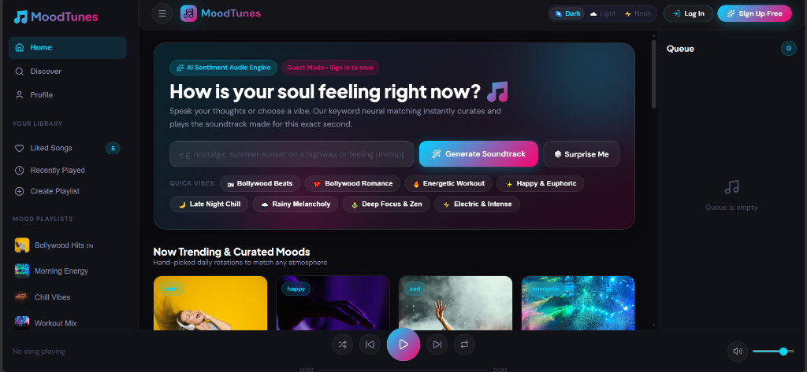

# 🚀 Utkarsh Rai — Portfolio Website

Welcome to my personal portfolio repository! This modern, responsive web application showcases my background, technical stack, featured projects, certifications, and software engineering experience.


---

## 👨‍💻 About Me

Hi, I'm **Utkarsh Rai** — a Computer Science undergraduate who enjoys building responsive, user-focused web applications and solving real-world problems through modern full-stack technologies. I specialize in frontend engineering, responsive design systems, RESTful backend services, and database optimization.

- 💼 **LinkedIn**: [linkedin.com/in/utkarsh1999rai](https://www.linkedin.com/in/utkarsh1999rai)
- 🐙 **GitHub**: [github.com/UTkarsh87020](https://github.com/UTkarsh87020)
- 📧 **Email**: [utk87020@gmail.com](mailto:utk87020@gmail.com)

---

## 🛠️ Tech Stack

### Frontend & UI
- **Frameworks & Languages**: JavaScript (ES6+), TypeScript, React 19, Next.js 15 (App Router), HTML5, CSS3
- **Styling**: Tailwind CSS, PostCSS, CSS Modules
- **Animations & Interactivity**: GSAP (GreenSock), Lenis (Smooth Scroll), Lucide Icons

### Backend & Database
- **Backend**: Node.js, Express.js, REST APIs
- **Databases**: MySQL, Relational Database Design, Query Optimization

### Developer Tools & Analytics
- Git, GitHub, AWS, Microsoft Excel, Power BI

---

## ⭐ Featured Projects

### 1. **FastTrack Delivery System**
> AI-powered smart logistics platform with route optimization, customer order lifecycle management, driver dispatching, live tracking, and emergency route support.
- **Repository**: [UTkarsh87020/FastTrack-Delivery](https://github.com/UTkarsh87020/FastTrack-Delivery)
- **Tech Stack**: JavaScript (ES6+), Node.js, Express.js, HTML5/CSS3
- **Highlights**: Nearest Neighbor Heuristic & Time-Window route optimization algorithms with interactive status dashboard.

### 2. **MoodTunes — Mood-Based Music Streaming Web App**
> Full-stack music streaming platform that analyzes user mood and sentiment from plain text using a localized NLP scoring engine to deliver dynamically matched soundtracks and real-time audio previews.

<p align="center">
  
</p>

- **Live Demo**: [moodtunes-lipx.onrender.com](https://moodtunes-lipx.onrender.com/)
- **Repository**: [UTkarsh87020/MoodTunes](https://github.com/UTkarsh87020/MoodTunes)
- **Tech Stack**: React 18, Vite, Node.js, Express.js, React Context API, iTunes Search API, CSS Custom Properties
- **Key Highlights**:
  - **Sentiment & Mood Engine**: Real-time keyword scoring and sentiment mapping across English, Hindi, and Spanish to curate genre-specific music tracks.
  - **Interactive Audio Player**: Persistent mini-player with drag-and-drop queue reordering, click-to-seek progress bar, volume controls, and audio wave visualizer.
  - **Multi-Theme UI System**: 3 custom-crafted glassmorphism themes (*Antigravity Dark*, *Cloud Nine*, and *Neon Dreams*) with responsive layouts scaling from mobile to a 3-column desktop view.

---

## 💼 Work Experience

### **Database Management Intern** — *Reckon Software* (Sep 2022 – Feb 2023)
- Designed and maintained production MySQL databases for core business applications, enforcing referential integrity across complex schemas.
- Authored and tuned advanced SQL queries (multi-table JOINs, correlated subqueries, and indexed lookups), measurably reducing retrieval latency and improving application response times.
- Documented schema structures and query patterns to support team knowledge transfer and streamline onboarding.

### **Web Development Intern** — *Mecatredz Technology* (Dec 2021 – Apr 2022)
- Developed interactive, fully responsive frontend components for live client-facing websites using HTML5, CSS3, and JavaScript, directly improving cross-device user experience.
- Collaborated with senior engineers in Agile sprints to review, refactor, and modernize legacy codebases applying Git branching and pull request workflows throughout.
- Gained practical SDLC exposure from requirements and design through code review, testing, and client-aligned delivery in a professional agency environment.

---

## 🏆 Certifications & Achievements

### **AWS Academy — Cloud Virtual Internship** *(Jan 2026 – Mar 2026)*
- Developed an understanding of cloud infrastructure, deployment concepts, and AWS-based technologies through structured learning.
- Strengthened technical problem-solving skills by exploring cloud-based application development and modern computing environments.

### **Java Full Stack Developer Virtual Internship** *(Oct 2025 – Dec 2025)*
- Completed a 10-week Java Full Stack Developer internship, gaining practical exposure to full-stack application development.
- Strengthened understanding of Java-based development and full-stack engineering workflows through structured technical training.

### **Innocodeathon 2024 — Outstanding Performance Finalist** *(May 2024)*
- Worked as a Frontend Developer, building fully responsive web pages with a focus on clean UI, usability, and cross-device compatibility.
- Collaborated with team *AI Avengers* to integrate frontend components and deliver the project within competition requirements.
- Recognized for Outstanding Performance in the final round of InnoCodeathon 2024 organized by ITS Engineering College.

---

## 💻 Getting Started Locally

### Prerequisites
- Node.js (v18.x or v20.x+)
- npm

### Installation & Setup

1. **Clone the repository**:
   ```bash
   git clone https://github.com/UTkarsh87020/Portfolio-.git
   cd Portfolio-
   ```

2. **Install dependencies**:
   ```bash
   npm install --legacy-peer-deps
   ```

3. **Start the development server**:
   ```bash
   npm run dev
   ```

4. **Open in browser**:
   Navigate to [http://localhost:3000](http://localhost:3000).

5. **Build for production**:
   ```bash
   npm run build
   npm start
   ```

---

## 📜 License

This project is licensed under the [MIT License](LICENSE).
